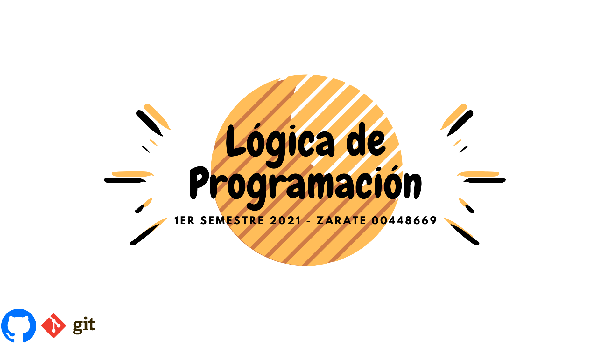

Repositorio - Logica De Programacion: 
Trabajos de clase de Lógica de programación 1er semestre 2021
Se incluyen todos los códigos entregables, organizados por talleres, quiz o laboratorio.
Hecho Por: Sebastián Andrés Zárate Sanmiguel ID: 000448669
